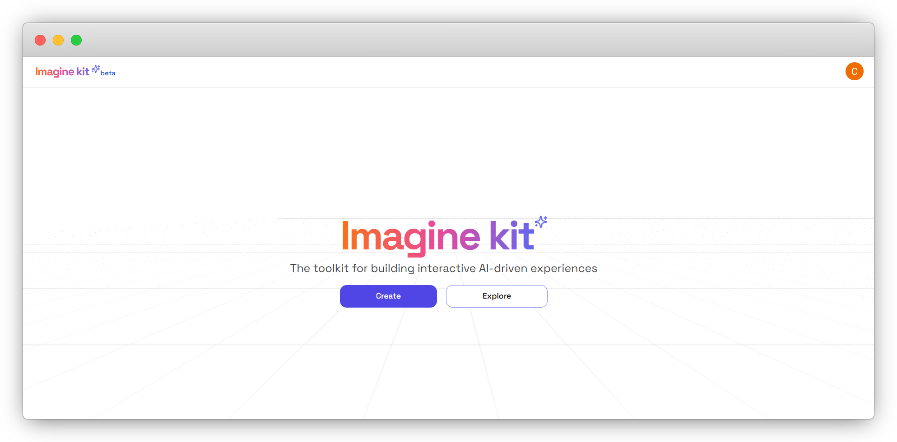
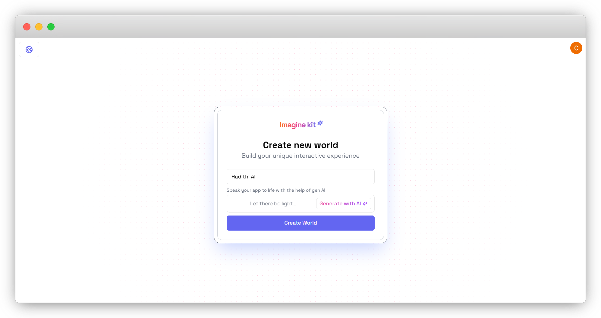
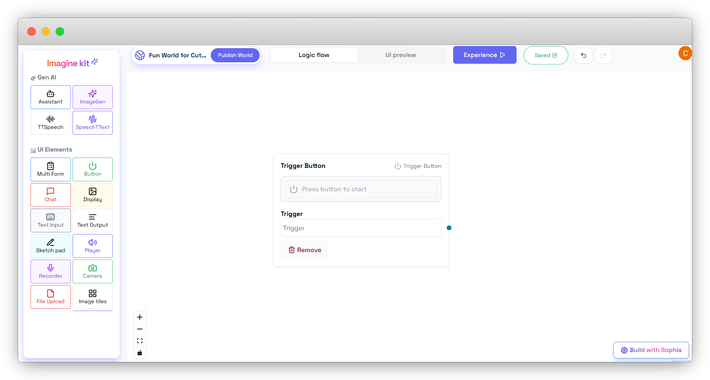

## 🏗️ How Do I Build My First Experience?

Imagine bringing stories to life with AI-generated narratives, images, and audio. In this tutorial, you'll create an interactive storytelling experience using ImagineKit, where users can generate and enjoy captivating African short stories enhanced with visuals and sound.

## 🔧 Step 1: Set Up the Project
To start, you need to create a new world in ImagineKit. This is the space where your interactive storytelling experience will come to life.

When you open ImagineKit, you’ll see a screen like the one below:

1. **Name Your World**: Click on the text box that says "Name your world" and type in a name that represents your storytelling project, such as *Hadithi AI*.

2. **Generate with AI (Optional)**: If you want ImagineKit to help generate your world’s logic flow, click the "Generate with AI" button. 

Alternatively, you can make the logic flow manually using AI and UI elements.

3. **Create World**: Once done, click the **Create World** button to proceed.

This will set up your new world where you can build and customize your storytelling flow.

- **Add a Trigger Button**: Click the Button from the UI Elements section to initiate the storytelling experience.

