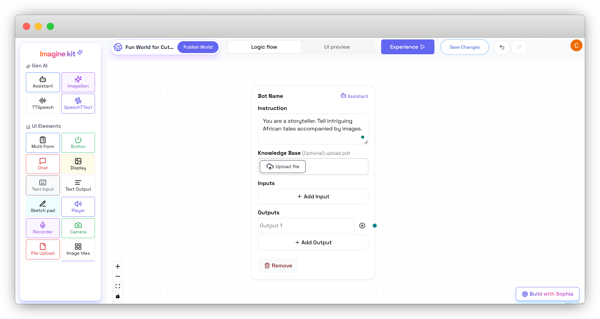

## 📝 Step 2: Create the Storytelling Logic

### Add an Assistant Node:
- Click the **Assistant** node to add it to the workflow.

- Set its instruction to:  
  > *"You are a storyteller. Tell intriguing African tales accompanied by images."*
- *(Optional)* Upload a knowledge base to provide more context.

### Define Inputs and Outputs:
- Click **Add Input** on the **Assistant** node and name it **Run**.
- Connect the **Trigger Button** to the **Assistant** node’s **Run** input.

- Add outputs:
  - Click **Add Output** on the **Assistant** node and name it **Story**.
  - **Story**: Main text of the generated story.
  - Add another **Output** on the **Assistant** node and name it **Story Image Prompt**.
  - **Story Image Prompt**: Text prompt to generate an image matching the story’s theme.

