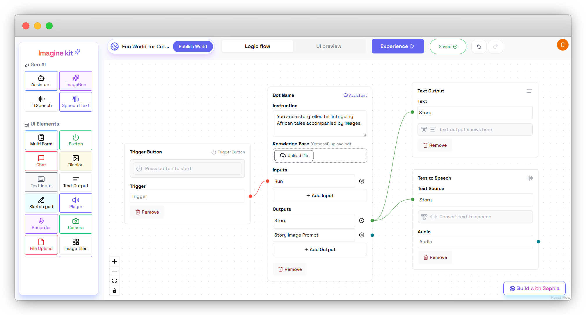
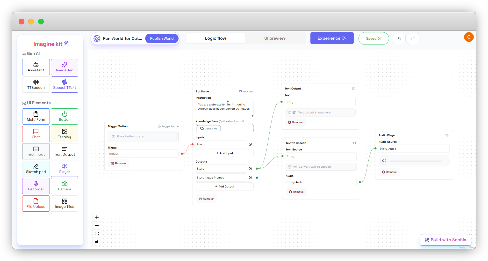

## 🎤 Step 4: Convert Story Text to Audio

### Add a Text-to-Speech Node:
- Drag the Text-to-Speech node to convert the story text into audio.
- Connect the Story output as the text source.

### Add an Audio Player:
- Drag an Audio Player node to play the generated audio.
- On the Text-to-Speech node, name the audio as **Story Audio**.
- Connect it to the Text-to-Speech node’s audio output.

