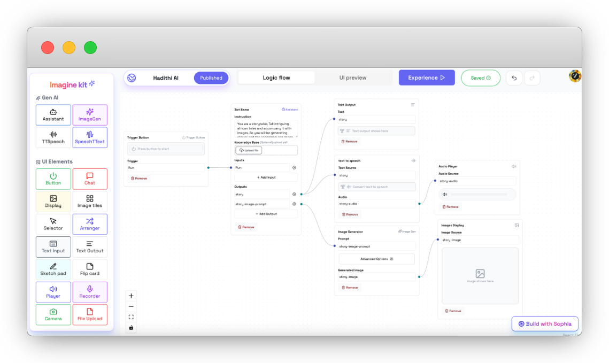

## 🖼️ Step 5: Generate and Display Images

### Add an Image Generator Node:
- Drag the Image Generator node to create an image based on the story.
- Connect it to the Story Image Prompt output.
- Adjust settings to match the storytelling theme.

### Add an Image Display Node:
- Drag an Image Display node to showcase the generated image.
- Connect it to the Image Generator node’s output.

Your flow should look something like this by now:

